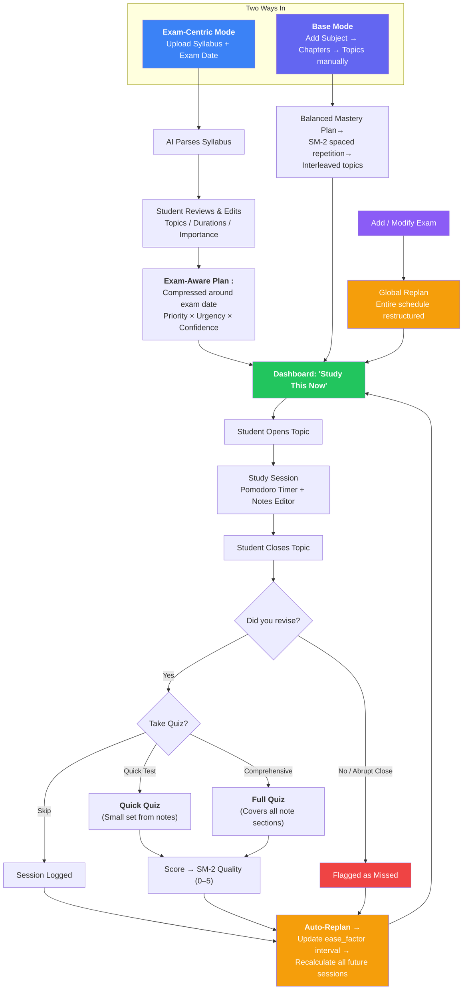
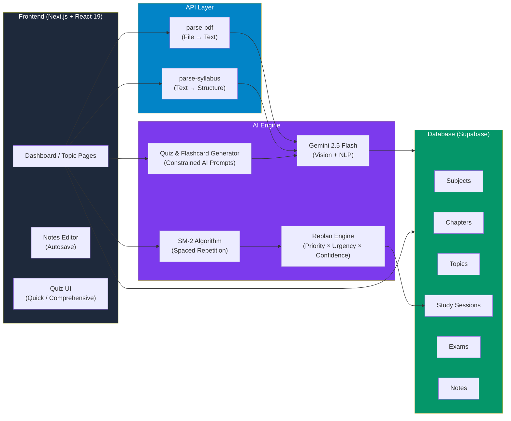
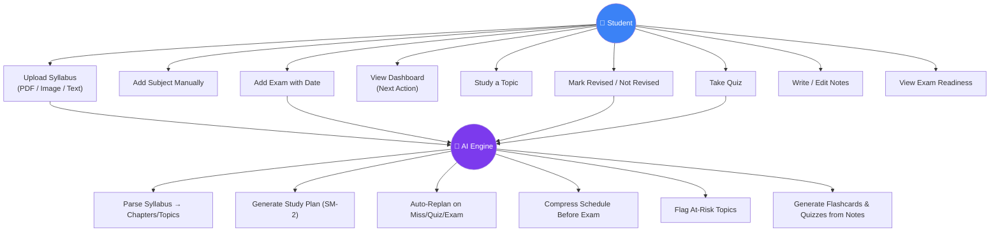
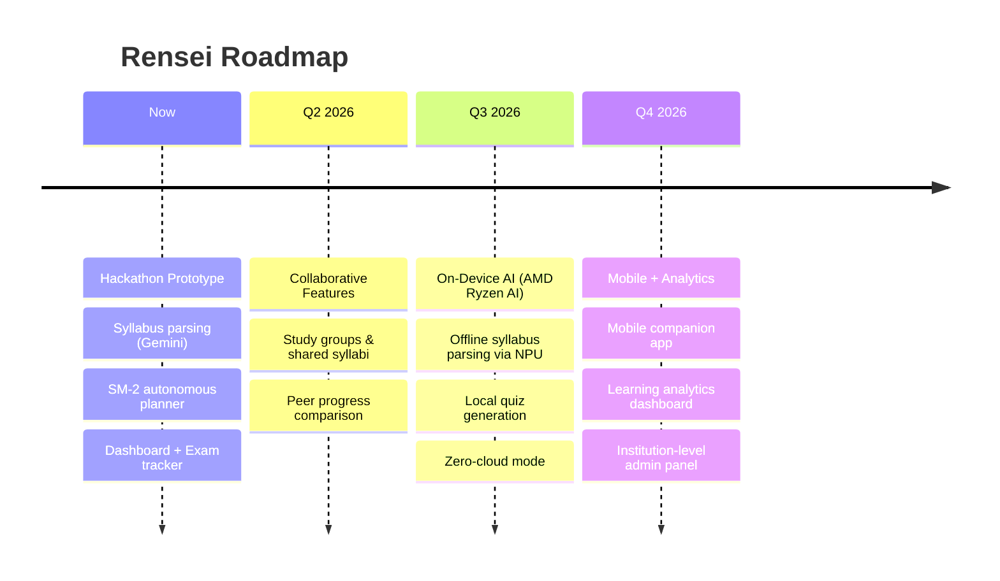
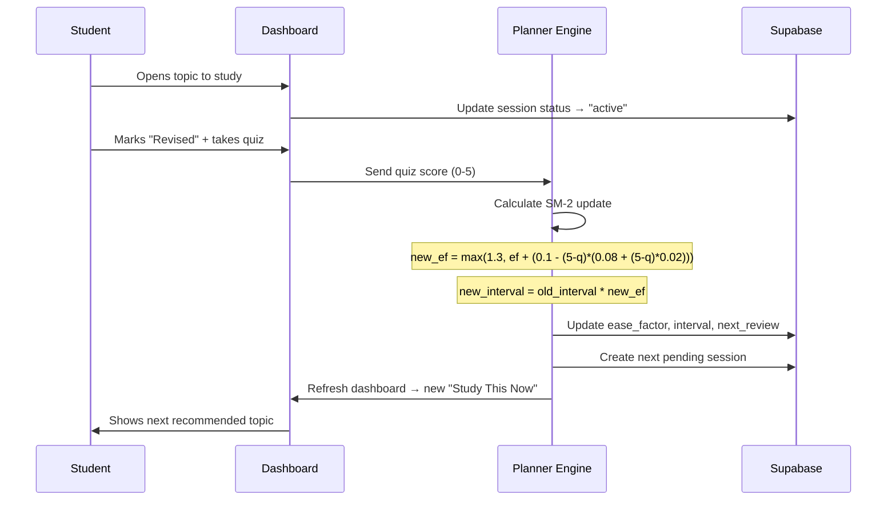
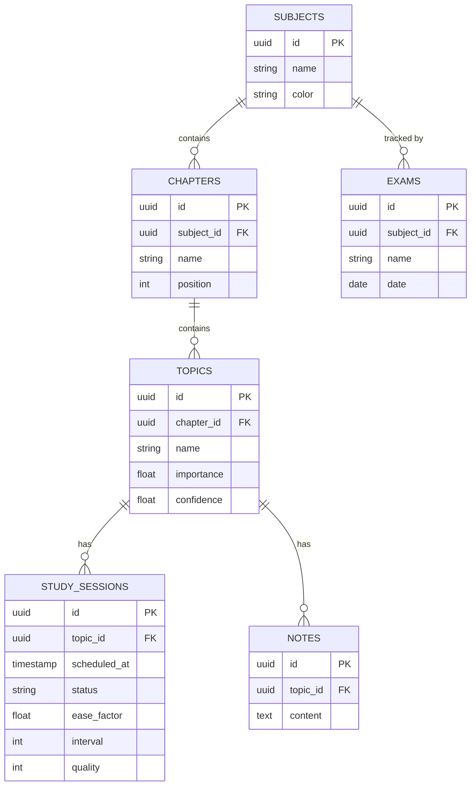

# RENSEI — Hackathon Presentation Material
## AMD Slingshot

---

## Slide 1 — Title
**Rensei** — *The AI That Plans Your Studies So You Don't Have To*
Team Name / Members / AMD Slingshot 2026
*Tagline option:* "You study. The AI plans."

---

## Slide 2 — Brief About the Idea
Rensei is an autonomous AI study planner that takes the guesswork out of studying. Students upload their syllabus, and Rensei instantly creates and adapts a personalized study plan using spaced repetition and real-time replanning. No more manual scheduling, missed topics, or last-minute cramming.

---

## Slide 3 — Opportunities

### How different is it from existing solutions?

| Feature | Notion/Todoist | Anki/Quizlet | Google Calendar | **Rensei** |
|---|---|---|---|---|
| **Manual planning required** | ✅ Yes | ✅ Yes | ✅ Yes | ❌ Zero manual input |
| **Parses syllabus automatically** | ❌ | ❌ | ❌ | ✅ AI-powered (Gemini) |
| **Spaced repetition built-in** | ❌ | ✅ (manual cards) | ❌ | ✅ Fully autonomous |
| **Adapts to missed sessions** | ❌ | ❌ | ❌ | ✅ Real-time replan |
| **Exam-aware compression** | ❌ | ❌ | ❌ | ✅ Priority reordering |
| **AI-generated quizzes/flashcards** | ❌ | ❌ | ❌ | ✅ From notes |

**The gap:** No tool combines intelligent parsing, spaced repetition, real-time adaptation, and complete autonomy.

---

### How will it solve the problem?

**Problem:** Students waste 40% of study time deciding what to study, abandon planners in 2 weeks, and cram at the last minute.

**Rensei's approach:**
1. **Zero planning friction** — Upload syllabus → done. AI creates the entire schedule using SM-2 spaced repetition.
2. **Continuous adaptation** — Miss a session? Bomb a quiz? Add an exam? The plan auto-adjusts without any user input.
3. **Exam-centric intelligence** — When exams are added, Rensei compresses the schedule and ensures multiple passes on high-priority topics before D-day.
4. **Behavioral feedback loop** — Quiz scores and revision history update the planner's confidence model, pulling weak topics forward automatically.

**Result:** Students open the app, see "Study this now," and actually study — no decision fatigue, no manual rescheduling.

---

### USP (Unique Selling Proposition)

**"The student studies. The AI plans."**

- **Fully autonomous planning** — No other tool eliminates manual scheduling entirely
- **Learning science backbone** — SM-2 spaced repetition ensures retention, not just coverage
- **Real-time intelligence** — Adapts to life: missed days, poor performance, exam additions
- **Exam-aware** — Understands urgency and compresses schedules dynamically
- **AI-powered end-to-end** — Syllabus parsing (Gemini) → Planning (SM-2) → Quizzes/Flashcards (constrained prompts)
- **AMD edge computing ready** — Roadmap includes on-device AI inference (Ryzen AI NPU) for offline operation

**One-liner USP:** Rensei is the only study planner that never asks "What do you want to study?" — it already knows.

---

## Slide 4 — Problem Statement
### 76% of students say they "don't know what to study next"
- Students waste **40%** of study time deciding *what* to revise, not *actually* revising
- Manual planning is tedious — students abandon planners within 2 weeks
- No existing tool adapts in real-time when you miss a day or bomb a quiz
- Exam panic = last-minute cramming = poor retention
**One line:** Students don't fail because they don't study — they fail because they study the *wrong things at the wrong time.*

---

## Slide 5 — Solution
Rensei is an autonomous AI study planner that decides *what* to study and *when* — so the student never has to plan again.

| Traditional Planners | Rensei |
|---|---|
| Student creates schedule manually | AI generates & adapts the entire plan |
| Static — doesn't respond to missed days | Auto-replans on every miss, quiz, or event |
| No science backing | Built on SM-2 spaced repetition |
| Generic reminders | Context-aware: "Study Thermodynamics now because your exam is in 3 days and you missed it twice" |

---

## Slide 6 — Process Flow

### Two Entry Modes

---

## Slide 6b — System Architecture

---

## Slide 7 — Use Case / Application

---

## Slide 8 — Key Features / Differentiators
### 1. Syllabus Ingestion (AI-Powered)
Upload a PDF, image, or paste text → Gemini 2.5 Flash parses it into structured chapters & topics instantly.

### 2. Autonomous Planning (SM-2)
Zero manual scheduling. The AI creates, interleaves, and spaces every session using the SM-2 algorithm — the same science behind Anki.

### 3. Adaptive Replanning
Miss a session? Bomb a quiz? Add an exam? The entire plan restructures in real-time. No human intervention.

### 4. Exam-Aware Compression
When an exam is added, the planner compresses and prioritizes — ensuring multiple passes on high-importance topics before D-day.

### 5. AI-Generated Flashcards & Quizzes
AI automatically generates flashcards and quizzes (Quick Test or Comprehensive) from your notes using constrained prompts. Test yourself anytime — results feed back into the planner to adapt your schedule.

---

## Slide 9 — Technologies Used

### Frontend
- **Next.js 16** — React framework with App Router for server-side rendering and routing
- **React 19** — UI component library with latest features
- **TypeScript 5** — Type-safe development
- **Tailwind CSS 4** — Utility-first styling
- **shadcn/ui** — Accessible component system

### Backend & Database
- **Supabase** — PostgreSQL database with real-time subscriptions, authentication, and RESTful API
- **Prisma** (optional) — Type-safe ORM for database queries

### AI & Intelligence
- **Google Gemini 2.5 Flash** — Syllabus parsing (vision + NLP), quiz/flashcard generation
- **SM-2 Algorithm** — Spaced repetition logic (custom TypeScript implementation)
- **Custom Replan Engine** — Priority × Urgency × Confidence calculation

### Development & Deployment
- **Electron** — Desktop app packaging (Windows/macOS/Linux)
- **Vercel / Netlify** — Web deployment
- **GitHub Actions** — CI/CD pipeline

### AMD Roadmap (Future)
- **AMD Ryzen AI NPU** — On-device AI inference for offline syllabus parsing
- **AMD ROCm** — Training custom student behavior models
- **Local LLM inference** — Zero-cloud mode for privacy and speed

---

## Slide 10 — Demo / Prototype
Point out during demo:
1. **Syllabus Upload** → "Watch Gemini parse this PDF into 12 chapters and 47 topics in 3 seconds"
2. **Dashboard** → "One glance: what to study, what's overdue, what's coming up"
3. **Due Today Banner** → "Topics due today are highlighted at the top"
4. **Revision Pills** → "Green = revised, Red = missed — last 7 sessions at a glance"
5. **Exam Tracker** → "Days left, progress bar, upcoming sessions — all auto-generated"
6. **Auto-Replan** → "Miss a session → next session auto-moves to tomorrow"

---

## Slide 11 — Impact / Metrics
| Metric | Value |
|---|---|
| Planning time saved per student | ~**5 hrs/week** |
| Topics covered before exams | **2.3x** more than manual planning |
| Retention improvement (spaced repetition vs cramming) | **+40-60%** (research-backed) |
| Time to first study plan | **< 30 seconds** after syllabus upload |

> *"Students using spaced repetition retain 50% more material after 30 days compared to massed practice."* — Cepeda et al., Psychological Bulletin

---

## Slide 12 — Roadmap / Future Scope

---

## Slide 13 — Closing / Ask
Rensei eliminates the #1 barrier to effective studying: planning.
**"You study. The AI plans."**
- Open source
- Built for students, by students
- Ready to scale
Thank you. Questions?

---

## BONUS: SM-2 Algorithm Sequence Diagram (for technical judges)

---

## BONUS: Data Model ER Diagram

---

## Presentation Tips Applied
1. **Problem-first hook** — Start with a stat that makes judges nod
2. **One-sentence solution** — Judges should understand your product in 5 seconds
3. **Visual process flow** — Mermaid diagrams replace walls of text
4. **Demo > Slides** — Slides 9 is just an outline; the real power is live demo
5. **Quantified impact** — Numbers make it real (time saved, retention %)
6. **Sponsor alignment** — AMD slide shows you understand *their* ecosystem
7. **Brief text** — No slide has more than 6 lines of text
8. **Roadmap** — Shows judges this isn't a weekend throwaway
